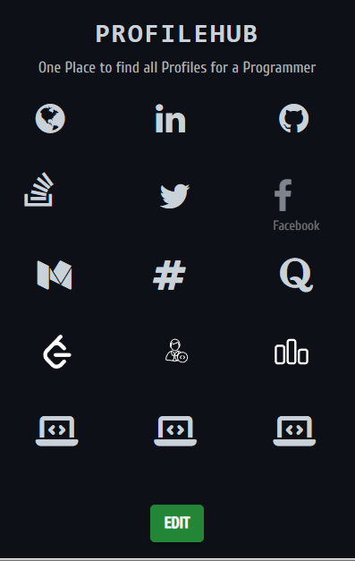

<p align="center">
  <a href="#">
    
    <h3 align="center">ProfileHub</h3>
  </a>
</p>

# ProfileHub Browser Extension

A simple browser extension that allows you to store and quickly access all your coding profiles from a single place. This extension saves links to your profiles in various coding platforms and social media, providing an easy way to navigate to them directly.

## Features

- Store and access links to various coding profiles.
- Quickly edit and update your profile links.
- Easy to use and navigate.

## Profiles Supported

- Website
- LinkedIn
- Medium
- Twitter
- Quora
- Codechef
- Facebook
- Stack Overflow
- Codeforces
- GitHub
- Spoj
- AtCoder
- FreeCodeCamp
- LeetCode
- HackerRank

## Installation

1. Clone the repository or download the ZIP file.

    ```bash
    git clone https://github.com/vivekPatil45/ProfileHub.git
    ```

2. Open your browser and navigate to the extensions page:
    - For Chrome: `chrome://extensions/`
    - For Edge: `edge://extensions/`

3. Enable "Developer mode" (usually found in the top right corner).

4. Click on "Load unpacked" and select the directory where you cloned or extracted the project.

## Usage

### Adding Your Profile Links

1. Click on the extension icon in your browser to open the popup.
2. Click on the "Edit" button to open the edit page.
3. Enter your profile links in the respective input fields.
4. Click the "Save" button to store the links.

### Accessing Your Profiles

1. Click on the extension icon in your browser to open the popup.
2. Click on any profile icon to navigate to the saved profile link.

## Files

- `popup.html`: The main HTML file for the popup UI.
- `edit.html`: The HTML file for editing the profile links.
- `popup.js`: JavaScript for handling the loading of profile links in the popup.
- `edit.js`: JavaScript for handling the saving and loading of profile links in the edit page.
- `styles.css`: CSS file for styling the popup and edit pages.

## Development

To make changes to the extension:

1. Edit the HTML, CSS, and JavaScript files as needed.
2. Reload the extension in your browser by navigating to the extensions page and clicking the reload icon.

## Screenshots

<div style="display: flex; justify-content: space-between;">
    <div style="flex: 0 0 48%; margin-left: 1%;">
        <h3>Main Page</h3>
        
    </div>
    <div style="flex: 0 0 48%; margin-right: 1%;">
        <h3>Edit Page</h3>
        
    </div>
    
</div>


## Contributing

Feel free to open issues or submit pull requests for any improvements or bug fixes.
